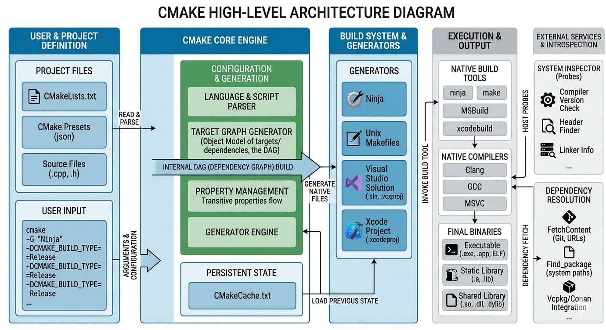

# Day 1

## Today's agenda

<pre>
- CMake Overview
  
- Introduction to Conan
  - What is Conan?
  - Why use a package manager for C/C++ applications?
  - Comparision with vcpkg, hunter and system-level package managers
  - Conan 1.x vs Conan 2.x
  
- Setup up the environment
  - Installing Conan v2.x

- CMake High-Level Architecture
- Conan High-Level Architecture

Hands-on Lab exercises
- Develop a C++ application with CMake
- Develop a C++ application that depends on static library with CMake
</pre>

## Info - CMake Overview
<pre>
- CMake is a build system generator
- it is not really a build tool, it depends on other build tools like Make, Ninja, MSBuild, etc.,
- in other words, it is a meta-build system
- is a Transpiler for Build Systems
- it takes CMakeLists.txt as input and transpiles it into a massive graph of dependencies and build rules
- it is opensource and a cross-platform meta-build system
- all our build instructions we will be writing in the CMakeLists.txt
- CMake reads the CMakeLists.txt and checks your system for compilers and your application dependencies
- it is a target based system
- it follows 3 stage workflow
  1. Configuration
     - Reads CMakeLists.txt, builds a dependency graph, caches system variables in CMakeCache.txt
  2. Generation
     - Produces native build files for the chosen "Generator"
       e.g Makefile, Ninja, Visual Studio Solution file, etc.,
  3. Build
     - Invokes the underlying build tool to compile the source code into binaries
- Advantages
  - Out of source builds
   - By building in a separate /build directory, the source tree remains clean
   - *.o, obj files will not clutter your code as intermediate files and binaries files will be generated in a separate folder
     typically build folder
   - independent of compiler
     - it can switch between GCC, Clang, MSVC without changing  a single line of project code
   - Extensibility
     - Features like FetchContent allows CMake to automatically download and integrate external Git Repositories during the 
       configuration phase
</pre>


## Info - CMake High Level Architecture


## Info - Conan Overview
<pre>
- Conan is a package manager for C/C++ applications
- it is opensource tool and cross-platform tool developed by JFrog
- it uses a conanfile.txt or conafile.py recipe file as the input
- Just like
  - NPM for NodeJS or Javascript languages
  - nuget for Visual Studio
  - pip for Python
  - Package Managers on the OS level
    - apt or apt-get, yum, rpm, dnf, etc.,
- Conan installs third-party packages on a project level
- Conan also supports transitive dependencies
  - Your application depends on Library A
  - Library A depends on B
  - B in turn depends on C
- there is no official, standalone desktop GUI provided by JFrog for the Conan package manager
- it is designed from the ground up as a command-line interface
- However, the C++ community has built several third-party graphical tools, and there are excellent 
  GUI integrations available directly within popular IDEs
  - examples
    - Conan Explorer (conan-app-launcher)
    - Barbarian & Conan-GUI
    - IDE Integrations
      - VS Code & CLion
        - Both editors have dedicated marketplace extensions for Conan
        - These extensions provide graphical menus to manage your profiles, search for packages, and execute conan install
        - They integrate cleanly with CMake, automating the generation and linking of your conanfile.txt dependencies so 
          you don't have to leave the editor
      - Qt Creator
        - Features a built-in Conan plugin
        - Once enabled, it can automatically set up the package manager for use with your CMake build configurations
    - Server-Side Web UI
      - JFrog Artifactory Community Edition
        - If your goal is a GUI to manage remote packages rather than a local client, 
          Artifactory CE provides a robust Web UI
        - It is free for C/C++ packages and allows you to browse, manage, and distribute your compiled binaries across your network
 </pre>

## Info - Why use Conan?
<pre>
- Application Binary Interface(ABI) compatibility
  - It ensures you don't link a debug library into a application built in Release mode (this could cause application crashes)
- Transitive Dependencies
  - It handles the Graph
    - If Library A depends on B
    - B depends on C
    - Conan solves the math for you
- Reproducibility
  - Using lockfiles, you can generate that your CI/CD builds the exact same code as your developer machine
- Cross-Platform
  - The same conanfile.py or conanfile.txt will work on Windows(Visual Studio), Linux (GCC) and Mac OS-X(Clang)
</pre>  

## Info - Alternate tools for Conan
<pre>
- vcpkg, hunter, qmake, etc.,  
</pre>

## Info - vcpkg(The modern standard)
<pre>
- created by Microsoft but now is a cross-platform tool
- vcpkg is current the one of the most popular choice for C++ developers
- How it works?
  - it uses a manifest file called vcpkg.json in your project root
  - when you run CMake, vcpkg automatically downloads and builds those libraries into a local folder
- Advantagess
  - Huge Library ( 2000+ packages), execellent IDE integration, and manifest mode that ensures everyone on your team
    uses the same version of the library
- Disadvantages
  - it builds everything from source code by default, which can take a long time on the first run
</pre>

## Info - Hunter
<pre>
- it is a CMake's native dependency management tool
- is unique because it is written entirely in CMake code, hence we don't need to install any other tool to get hunter
- How it works?
  - You add a few lines to your CMakeLists.txt to gate the project
  - It then handles downloading and building dependencies during the cmake configuration step
- Advantages
  - Zero external dependencies, if you have CMake installed already then you have hunter by default
  - It follows pure CMake philosophies perfectly
- Disadvantages
  - Much smaller library(repository) than vcpkg or conan
  - It can significantly slow down your intinial configuration time becuase CMake is doing the heavy-lifting of dependency management
  - CMake is good as meta-build system, hence not an ideal choice for dependency management
</pre>

## Info - Conan v1.x vs v2.x
<pre>
- Conan believes the core philosophy - that everything is a graph
- Conan v1.x
  - Treats dependencies more like a flat list
  - It often struggles with diamond dependencies
  - where two libraries depend on different versions of a third library 
  - requires complex workaround to deal with the diamond dependency issue
- Conan v2.x
  - Built on a rigorous dependency graph model
  - every version conflict or configuration mismatch is caught during the initial graph resolution, before a single file is downloaded
  - I wouldn't say diamond dependency issue will not happen in Conan v2.x, whenever it encounters such dependency issues, it will let us manually
    resolve that like how git handles the automatic merge, in case it finds a merge conflict which can't be automatically resolved, it will
    report the issue and let us deal with it manually
</pre>

## Info - Conan High-Level Architecture


## Info - Installing Conan 
```
pip install conan
```

## Lab - Hello World C++ projec with CMake
```
cd ~/conan-march-2026
cd Day1/
mkdir -p hello/{src,inc}
touch src/main.cpp src/hello.cpp inc/hello.h
touch CMakeLists.txt
tree
```


Build and run the application using cmake
```
cd ~/conan-march-2026
git pull
Day1/hello

mkdir build && cd build
cmake ..
cmake --build .
```


Build the application in debug mode
```
cd ~/conan-march-2026
cd Day1/hello
rm -rf build
mkdir build

cmake -S . -B build/debug -DCMAKE_BUILD_TYPE=Debug
cmake --build build/debug
```


Build the application in release mode
```
cd ~/conan-march-2026
cd Day1/hello
rm -rf build
mkdir build

cmake -S . -B build/release -DCMAKE_BUILD_TYPE=Release
cmake --build build/release
```


## Lab - Hello World iwth a static library
```
cd ~/conan-march-2026
git pull
cd Day1

mkdir -p HelloCppWithStaticLib/{src,lib}
mkdir -p HelloCppWithStaticLib/lib/{src,inc}

cd HelloCppWithStaticLib

touch CMakeLists.txt
touch src/main.cpp
touch lib/src/hello.cpp
touch lib/inc/hello.h

tree ../HelloCppWithStaticLib
```


Build and Run the application
```
cd ~/conan-march-2026
cd Day1/HelloCppWithStaticLib

cmake -S . -B build/debug -DCMAKE_BUILD_TYPE=Debug
cmake --build build/debug
```


